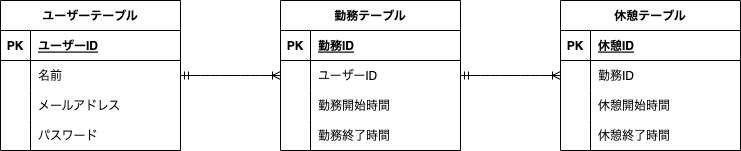

# アプリケーション名
「 atte 」

## アプリケーション概要
勤怠管理システムです。  
出勤は1日1回で日を跨ぐとリセットされます。  
休憩は何回でも取れます。

## アプリケーションURL
https://github.com/fujiikenichirou/atte.git

##　機能一覧
- ログイン機能
- 勤怠打刻
- 日付別勤怠情報取得

## 使用技術
- php 7.4.9
- laravel 8.x
- docker-compose 3.8
- mysql

## テーブル設計

## ER図

# 環境構築
ディレクトリの作成
.
├── docker
│   ├── mysql
│   │   ├── data
│   │   └── my.cnf
│   ├── nginx
│   │   └── default.conf
│   └── php
│       ├── Dockerfile
│       └── php.ini
├── docker-compose.yml
└── src

docker-compose.yml の作成
version: '3.8'

services:
    nginx:
        image: nginx:1.21.1
        ports:
            - "80:80"
        volumes:
            - ./docker/nginx/default.conf:/etc/nginx/conf.d/default.conf
            - ./src:/var/www/
        depends_on:
            - php

    php:
        build: ./docker/php
        volumes:
            - ./src:/var/www/

    mysql:
        image: mysql:8.0.26
        environment:
            MYSQL_ROOT_PASSWORD: root
            MYSQL_DATABASE: laravel_db
            MYSQL_USER: laravel_user
            MYSQL_PASSWORD: laravel_pass
        command:
            mysqld --default-authentication-plugin=mysql_native_password
        volumes:
            - ./docker/mysql/data:/var/lib/mysql
            - ./docker/mysql/my.cnf:/etc/mysql/conf.d/my.cnf

    phpmyadmin:
        image: phpmyadmin/phpmyadmin
        environment:
            - PMA_ARBITRARY=1
            - PMA_HOST=mysql
            - PMA_USER=laravel_user
            - PMA_PASSWORD=laravel_pass
        depends_on:
            - mysql
        ports:
            - 8080:80

Nginx の設定
default.confファイルの記述
server {
    listen 80;
    index index.php index.html;
    server_name localhost;

    root /var/www/public;

    location / {
        try_files $uri $uri/ /index.php$is_args$args;
    }

    location ~ \.php$ {
        fastcgi_split_path_info ^(.+\.php)(/.+)$;
        fastcgi_pass php:9000;
        fastcgi_index index.php;
        include fastcgi_params;
        fastcgi_param SCRIPT_FILENAME $document_root$fastcgi_script_name;
        fastcgi_param PATH_INFO $fastcgi_path_info;
    }
}

PHP の設定

Dockerfileの記述
FROM php:7.4.9-fpm

COPY php.ini /usr/local/etc/php/

RUN apt update \
  && apt install -y default-mysql-client zlib1g-dev libzip-dev unzip \
  && docker-php-ext-install pdo_mysql zip

RUN curl -sS https://getcomposer.org/installer | php \
  && mv composer.phar /usr/local/bin/composer \
  && composer self-update

WORKDIR /var/www

php.iniファイルの記述
date.timezone = "Asia/Tokyo"

[mbstring]
mbstring.internal_encoding = "UTF-8"
mbstring.language = "Japanese"

MySQL の設定

my.cnfファイルの記述
[mysqld]
character-set-server = utf8mb4

collation-server = utf8mb4_unicode_ci

default-time-zone = 'Asia/Tokyo'

docker-compose コマンドでビルド

コマンドライン上
$ docker-compose up -d --build
$ docker-compose exec php bash

Laravelのプロジェクトの作成

PHPコンテナ内
$ composer create-project "laravel/laravel=8.*" . --prefer-dist

app.php | 70行目
'timezone' => 'UTC',
に変更してください。